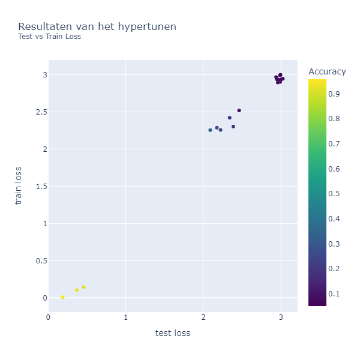
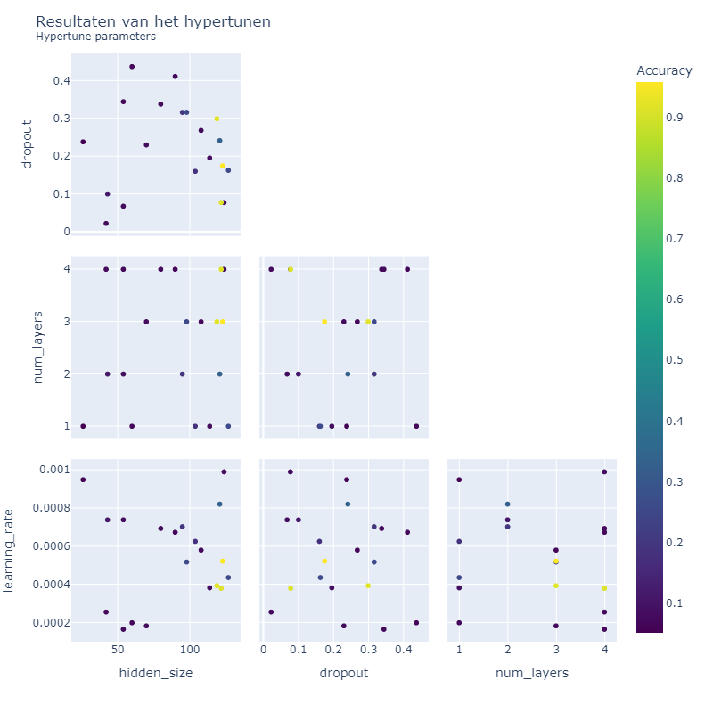
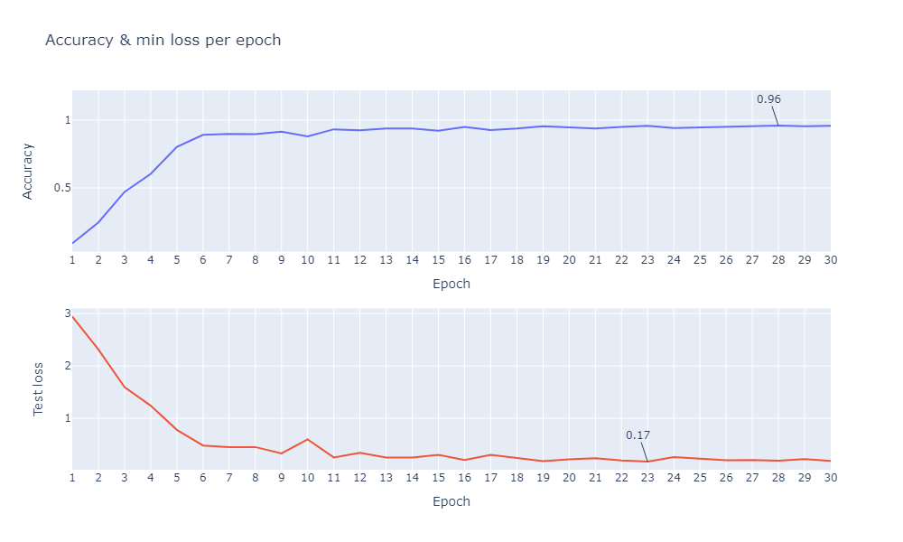

# Tentamen ML2022-2023

De opdracht is om de audio van 10 cijfers, uitgesproken door zowel mannen als vrouwen, te classificeren. De dataset bevat timeseries met een wisselende lengte.

In [references/documentation.html](references/documentation.html) lees je o.a. dat elke timestep 13 features heeft.
Jouw junior collega heeft een neuraal netwerk gebouwd, maar het lukt hem niet om de accuracy boven de 67% te krijgen. Aangezien jij de cursus Machine Learning bijna succesvol hebt afgerond hoopt hij dat jij een paar betere ideeen hebt.

## Vraag 1

### 1a
In `dev/scripts` vind je de file `01_model_design.py`.
Het model in deze file heeft in de eerste hidden layer 100 units, in de tweede layer 10 units, dit heeft jouw collega ergens op stack overflow gevonden en hij had gelezen dat dit een goed model zou zijn.
De dropout staat op 0.5, hij heeft in een blog gelezen dat dit de beste settings voor dropout zou zijn.

- Wat vind je van de architectuur die hij heeft uitgekozen (een Neuraal netwerk met drie Linear layers)? Wat zijn sterke en zwakke kanten van een model als dit in het algemeen? En voor dit specifieke probleem?

**Antwoord 1a**

Het voorbeeld is een lineair neural netwerk gemaakt die bestaat uit drie lineaire lagen met twee activatie (ReLu) functies. Er zijn een aantal voordelen van deze architectuur:<br>
<ul>
<li>Het is simpel model en hierdoor kost het minder computerkracht om het model te draaien.</li>
<li>Door de lineaire lagen is het redelijk intepreteerbaar en uitlegbaar omdat de meeste mensen snappen hoe een lineaire regressie werkt. </li>
</ul> <br>
Er zijn ook een aantal nadelen:<br>
<ul>
<li>Omdat lineaire modellen een rechte lijn tussen in- en output trekken zijn ze gevoelig voor outliers.</li>
<li>Doordat lineare modellen gevoelig zijn voor outliers wordt de kans op overfitting groter omdat er teveel focus ligt op de extremen in de data. Hierdoor worden de belangrijke patronen gemist en niet goed gegeneraliseerd.</li>
<li>Het model houdt geen rekening met afhankelijkheden in de data. Iedere kolom wordt als onafhankelijke input gezien zonder dat er rekening gehouden wordt met onderlinge relaties in kolommen, wat wel van belang is bij tijdserie data. </li>
<li>Lineaire modellen zijn vaak te simpel om echt de belangrijke patronen in de data te ontdekken</li>
</ul>
<br>
Voor het probleem wat wordt gesteld is deze architectuur niet de juiste keuze. Omdat het om spraak data, tijdseries, gaat is het beter om een architectuur te kiezen die kan omgaan met volgordelijkheid in data en een geheugen heeft. De architectuur die gekozen is kan bijvoorbeeld wel geschikt zijn voor een simpele classificatie op basis van tabulaire data.<br>
<br>
- Wat vind je van de keuzes die hij heeft gemaakt in de LinearConfig voor het aantal units ten opzichte van de data? En van de dropout?
<br>
<br>
<ul>
<li>H1=100; dit is best een groot aantal hidden units om dit model mee te beginnen. De input is 13 dus het is beter om kleiner te beginnen, uit te testen en eventueel aan te passen. Ik zou zelf eerder beginnen met 32 of 64.</li>
<li>H2=10, de stap tussen 100 en 10 is best groot. Dit betekent dat het model in de tweede laag veel minder goed complexe patronen kan leren.</li>
<li>Drop_out = 0.5 is ook wel heel hoog in deze architectuur. In de tweede laag wordt er al terug gegaan naar een hidden size van 10, waarvan dan vervolgens ook nog 50% van op 0 worden gezet. Dit betekent dat het model niet goed complexe structuren kan leren. </li>
<br>

## 1b
Als je in de forward methode van het Linear model kijkt (in `tentamen/model.py`) dan kun je zien dat het eerste dat hij doet `x.mean(dim=1)` is. 

**Antwoord 1b**
- Wat is het effect hiervan? Welk probleem probeert hij hier op te lossen? (maw, wat gaat er fout als hij dit niet doet?)<br>
<br>
Tijdserie data is drie dimensionaal. Met de regel code wordt het gemiddelde berekend van de tweede dimensie van de tensor, dit is de sequence length. Wanneer dit niet wordt gedaan werken de lineaire lagen niet omdat een lineaire laag een 2 dimensionale input nodig heeft.

- Hoe had hij dit ook kunnen oplossen?<br>
<br>
Door de maximale of minimale waarde te nemen van een tensor.

- Wat zijn voor een nadelen van de verschillende manieren om deze stap te doen?
Gemiddelde: Heeft als voordeel dat het een overal beeld geeft van de tensor.<br>
Minimale waarde: dit kan de beste keuze zijn wanneer je opzoek gaat naar de minste waardes. ALs je bijvoorbeeld in een dataset met geluid opzoek gaat naar de stille periodes in audio data.<br>
Maximale waarde: dit kan de beste keuze zijn wanneer je opzoek gaat naar de hoogste waardes. Als je bijvoorbeeld geluid wil classificeren in een rustige achtergrond.<br>
Het heeft allemaal als nadeel dat veel informatie niet meegenomen wordt. Daarom werkt een 2 dimensionale laag niet goed als basis voor 3 dimensionale data. 
<br>


<br>

## 1c
Omdat jij de cursus Machine Learning hebt gevolgd kun jij hem uitstekend uitleggen wat een betere architectuur zou zijn.

- Beschrijf de architecturen die je kunt overwegen voor een probleem als dit. Het is voldoende als je beschrijft welke layers in welke combinaties je zou kunnen gebruiken.<br>'
<br>Voor dit probleem is een recurrent neural network de beste optie. Dit is omdat RNN's goed kunnen omgaan met volgordelijkheid in datasets. RNN's bewaren namelijk informatie uit de vorige laag in tegenstelling tot het netwerk die als voorbeeld is gemaakt waarbij de informatie per stap opnieuw wordt verwerkt. Voor dit specifieke probleem waarbij taal moet worden herkent in een audioclip is waarschijnlijk een GRU architectuur de beste optie. Normale RNN's hebben het probleem dat het niet goed kan omgaan met lange afstand afhankelijkheden in tijd. Een GRU architectuur kan hier beter mee omgaan omdat er door de gates op korte termijn belangrijke informatie kan worden onthouden. Een andere optie kan een LSTM architectuur zijn. Voor dit probleem is een GRU waarschijnlijk voldoende omdat het audioclips zijn waarin 1 cijfer wordt genoemd. Een LSTM kan bijvoorbeeld beter werken wanneer er een cijfer uit een zin moet worden gehaald. 
<br>
<br>
- Geef vervolgens een indicatie en motivatie voor het aantal units/filters/kernelsize etc voor elke laag die je gebruikt, en hoe je omgaat met overgangen (bv van 3 naar 2 dimensies). Een indicatie is bijvoorbeeld een educated guess voor een aantal units, plus een boven en ondergrens voor het aantal units. Met een motivatie laat je zien dat jouw keuze niet een random selectie is, maar dat je 1) andere problemen hebt gezien en dit probleem daartegen kunt afzetten en 2) een besef hebt van de consquenties van het kiezen van een range.<br>
<br>
**Antwoord 1c**
<br>

 In het onderstaande codevoorbeeld staat de GRU architectuur die ik ga gebruiken voor mijn model. Onder de code leg ik de keuzes uit.<br>

```
{
  
  GRUmodel(nn.Module):

      def __init__(self, config: Dict) -> None:
        super().__init__()
        self.rnn = nn.GRU(
            input_size=config[“input_size”],
            hidden_size=config[“hidden_size”],
            dropout=config[“dropout”],
            batch_first=True,
            num_layers=config[“num_layers”],
        )
        self.linear = nn.Linear(config[“hidden_size”], config[“output_size”])

    def forward(self, x: Tensor) -> Tensor:
        x, _ = self.rnn(x)
        last_step = x[:, -1, :]
        yhat = self.linear(last_step)
        return yhat

}
```
<br>
Het gaat om een dataset met ongeveer 8000 regels met ieder 13 features waar 20 classes moet worden geclassificeerd. De dataset bestaat uit mensen (mannen en vrouwen) die een nummer van 0 tot 9 in het Arabisch uitspreken. Een GRU architectuur past hier dus goed bij omdat het om kan gaan met volordelijkheid in data door het geheugen en de gates. De data is in eerste instantie drie dimensionaal en bestaat uit; batchsize, sequence length en hidden size. <br>
Die data gaat door het aantal GRU layers wat wordt aangegeven door de parameter num_layers. Het aantal layers bepaald hoe vaak de data dus door die lagen heen gaat. Voor dit probleem verwacht ik dat 2 of 3 layers voldoende is. Ik verwacht dat dit voldoende is omdat het een dataset is met 13 features. Doordat dit relatief weinig kolommen zijn is waarschijnlijk een minder diep model voldoende om te leren wat wel en niet belangrijke informatie is in de data. Een voorbeeld waarbij meer lagen mogelijk nuttiger zouden kunnen zijn is wanneer je sentiment analyse op lange reviews moet doen, waarschijnlijk is werkt een LSTM architectuur dan nog beter. <br>
De parameter hidden_size bepaald hoe groot het geheugen is voor de hidden state. De hidden state vat de informatie samen en beslist wat doorgaat naar de volgende GRU laag. Ook bij deze parameter verwacht ik dat een klein aantal voldoende is. Ik zou starten bij 16 of 32 en op opbouwen tot maximaal 128. Door het klein te houden wordt het aantal parameters in het model klein gehouden, kan het model sneller trainen en wordt de kans op overfitting minder groot. <br>
Een drop out toevoegen helpt ook bij mogelijk overfitten en zorgt ervoor dat het model beter kan omgaan met nieuwe data. Om te testen of dit ook voordelen heeft voor deze specifieke opdracht zou ik alles van 0 t/m 0,5 willen uitproberen. Ik verwacht wel dat 0,5 echt te hoog is omdat er dan teveel data niet wordt gebruikt. <br>
Met een lineaire functie wordt er van 3 naar 2 dimensies gegaan. Een lineaire laag helpt bij het minder dimensionaal maken van de data en zorgt ervoor dat er sneller voorspellingen gemaakt kunnen worden. De output van de lineaire functie heeft het aantal classes dat moet worden voorspeld, in dit geval 20. <br>
<br>

- Geef aan wat jij verwacht dat de meest veelbelovende architectuur is, en waarom (opnieuw, laat zien dat je niet random getallen noemt, of keuzes maakt, maar dat jij je keuze baseert op ervaring die je hebt opgedaan met andere problemen).<br>


<br>

```
{
 config_GRU = GruConfig(
        input=13,
        output=20,
        tunedir=presets.logdir,
        num_layers=2,
        hidden_size=16,
        dropout=0.2,
    )

    trainedmodel = trainloop(
        epochs=20,
        model=model_gru,  # type: ignore
        optimizer=torch.optim.Adam,
        learning_rate=1e-3,
        loss_fn=torch.nn.CrossEntropyLoss(),
        metrics=[Accuracy()],
        train_dataloader=trainstreamer.stream(),
        test_dataloader=teststreamer.stream(),
        log_dir=presets.logdir,
        train_steps=len(trainstreamer),
        eval_steps=len(teststreamer),
    )

}
```

<br>
Ik verwacht dat 2 lagen voldoende is om een goed resultaat te bereiken, omdat het aantal features relatief laag is en het probleem niet heel complex is. Mogelijk werkt 3 lagen beter, dus ik zal deze optie meenemen in vraag 1D. Meer lagen zorgen voor een complexere architectuur waardoor de kans op overfitting toeneemt. Daarnaast kosten meer lagen ook gewoon meer computerkracht dus is het verstandig om klein te beginnen. <br>
Er zijn 13 input features en 20 output classes, waar 16 tussen zit, dus ik zal de hidden_size daarmee beginnen. Het kan zijn dat 32 als hidden_size een betere prestatie oplevert, dus ik zal dit ook meenemen in vraag 1D. Ik verwacht dat de kans op overfitting toeneemt bij een hidden_size van 128 omdat het aantal parameters wat het model dan gebruikt sterk toeneemt. Omdat er dan mogelijk teveel focus wordt gelegd op de outliers in de data bestaat de kans dat het model te goed gaat werken op de trainset maar niet meer generaliseerd op de test set. <br>
Voor de training settings wordt er begonnen met 50 epochs om te bekijken of het model blijft leren of dat een lager aantal beter is. Ik verwacht dat minder voldoende gaat zijn omdat het aantal epochs dat een model nodig heeft om goed te leren ook samenhangt met de complexiteit van de taak. Daarnaast hangt het ook af van de architectuur, met 2 lagen en 16 als hidden size is mogelijk 20 epochs genoeg om tot een goede accuracy te komen. Door nu te testen met 50 epochs kan worden achterhaald op welk punt in de epochs het model stopt met het maken van verbeteringen.<br> 
De learningrate blijft staan op 1-e3 om te bekijken of dit voldoende werkt met de archictectuur.<br>
<br>

### 1d
Implementeer jouw veelbelovende model: 

- Maak in `model.py` een nieuw nn.Module met jouw architectuur
- Maak in `settings.py` een nieuwe config voor jouw model
- Train het model met enkele educated guesses van parameters. 
- Rapporteer je bevindingen. Ga hier niet te uitgebreid hypertunen (dat is vraag 2), maar rapporteer (met een afbeelding in `antwoorden/img` die je linkt naar jouw .md antwoord) voor bijvoorbeeld drie verschillende parametersets hoe de train/test loss curve verloopt.
- reflecteer op deze eerste verkenning van je model. Wat valt op, wat vind je interessant, wat had je niet verwacht, welk inzicht neem je mee naar de hypertuning.

<br>

**Antwoord 1d**

**Run 1: 2 layers, hidden_size van 16 en drop_out 0.2 (roze lijn)**

Ik heb voor de eerste run de architectuur gebruikt zoals beschreven in 1C.
Op de onderstaande afbeeldingen staan de loss grafieken van de test en train set uit Tensorboard.
Het model lijkt na 50 epochs nog steeds nieuwe patronen te ontdekken omdat de lijn nog naar beneden gaat. Het model is dus nog niet aan het over- of underfitten.

<figure>
  <p align = "center">
    
    <figcaption align="center">
      <b> Figuur 1: Train vs Test loss run 1.</b><br>
      <i> Run 1: roze | Run 2: geel | Run 3: paars</i>
    </figcaption>
  </p>
</figure>

<br>

In de onderstaande afbeelding staan de waarden van runs van de laatste 20 epochs.

<figure>
  <p align = "center">
    
    <figcaption align="center">
      <b> Figuur 2: Train vs Test loss & Accuracy dataframe run 1</b>
    </figcaption>
  </p>
</figure>
Het model lijkt na 50 epochs nog steeds te leren omdat de accuracy omhoog blijft gaan en loss op de validatie en train set ook steeds minder wordt. De verhouding tussen de loss op validatie en train is goed, de validatie op de train is iets lager wat betekent dat het model nog niet aan het over- of underfitten is. Wel is de accuracy met bijna 80% nog niet zo heel hoog. Daarom ga ik in de volgende run de hidden size naar 32 zetten zodat er meer parameters zijn die worden meegenomen in het model.


<br>

**Run 2: 2 layers, hidden_size van 32 en een dropout van 0.2**

Omdat een accuracy van 80% nog niet zo hoog is en het model nog erg simpel was heb ik de hidden_size aangepast naar 32. Voor de rest heb ik het model laten staan zoals beschreven in 1C. 

Op de onderstaande afbeeldingen staan de loss grafieken van de test en train set uit Tensorboard.
Het model lijkt na 20 epochs iets minder snel te verbeteren omdat de lijn minder stijl naar beneden gaat, mogelijk is er voldoende resultaat ergens tussen de 20 en 30 epochs. 

<figure>
  <p align = "center">
    
    <figcaption align="center">
      <b> Figuur 3: Train vs Test loss run 2.</b><br>
      <i> Run 1: roze | Run 2: geel | Run 3: paars</i>
    </figcaption>
  </p>
</figure>

<br>

In de onderstaande afbeelding staan de waarden van runs van de laatste 20 epochs.


<figure>
  <p align = "center">
    
    <figcaption align="center">
      <b> Figuur 4: Train vs Test loss & Accuracy dataframe run 2</b>
    </figcaption>
  </p>
</figure>

De accuracy van het model is sterk verbeterd ten opzichte van een model met 16 als hidden size. Het toevoegen van die parameters heeft dus zin. Het is nu relatief een simpel model met 32 als hidden size en 2 lagen, daarmee wordt al een accuraatheid behaald van 91%. De verhouding tussen de loss op de test en trainset is ook goed. De loss op de trainset mag iets hoger zijn dan op de test set maar als het teveel uit elkaar loopt dan is het model aan het overfitten. Zoals benoemd bij de grafiek lijkt het model na 20 epochs iets minder snel te verbeteren maar ook in de laatste 30 epochs neemt de loss op de test set nog iets af en de accuracy toe. 


<br>

**Run 3: 3 layers, hidden_size van 32 en dropout van 0.2**

Door een extra laag toe te voegen aan het model wordt de GRU laag een extra keer doorlopen. Dit kan betekenen dat de accuracy omhoog gaat maar het kan ook betekenen dat de kans op overfitting groter wordt. Ik heb de hidden size laten staan op 32 omdat dit voor een flinke verbetering in accuracy zorgde in de vorige run. Het model is dus iets complexer dan bij de eerste run en heeft meer parameters om van te leren. 


Op de onderstaande afbeeldingen staan de loss grafieken van de test en train set uit Tensorboard. <br>
Het lijkt erop alsof het model nu begint met overfitten. Wanneer je de lijnen van run 2 en 3 vergelijkt dan zie je dat de loss op de train set iets verbeterd maar de loss op de test set eigenlijk niet verbeterd na het doorlopen van 50 epochs. De loss op de test set is rond 30 epochs wel aanzienlijk minder dan bij de tweede run. Het kan dus ook zijn dat de combinatie van 3 lagen en 50 epochs zorgt voor overfitten maar een model met 3 lagen en 30 epochs niet. 

<figure>
  <p align = "center">
    
    <figcaption align="center">
      <b> Figuur 5: Train vs Test loss run 3.</b> <br>
      <i> Run 1: roze | Run 2: geel | Run 3: paars</i>
    </figcaption>
  </p>
</figure>

<br>

In de onderstaande afbeelding staan de waarden van runs van de laatste 20 epochs.


<figure>
  <p align = "center">
    
    <figcaption align="center">
      <b> Figuur 6: Train vs Test loss & Accuracy dataframe run 3</b>
    </figcaption>
  </p>
</figure>

In de bovenstaande tabel wordt duidelijk dat in de laatste 20 epochs de loss op de test set nauwelijks omlaag is gegaan en de loss op de trainset duidelijk wel. De learning rate gaat ook omlaag wat duid op een plateau en overfitten. 


**Conclusie**

Een simpel model is waarschijnlijk beter dan een heel complex model voor dit probleem. Met 2 of 3 lagen en lage hiden size wordt er al rond de 90% accuracy behaald. Omdat het model tijdens de laatste run aan het overfitten is en bij de eerste run na 50 epochs nog aan het leren was neem ik de learning rate mee als hypertune parameter. Een goed passende learning rate zorgt ervoor dat het model op de juiste snelheid kan leren en overfitting kan voorkomen. 


## Vraag 2
Een andere collega heeft alvast een hypertuning opgezet in `dev/scripts/02_tune.py`.

### 2a
Implementeer de hypertuning voor jouw architectuur:
- zorg dat je model geschikt is voor hypertuning
- je mag je model nog wat aanpassen, als vraag 1d daar aanleiding toe geeft. Als je in 1d een ander model gebruikt dan hier, geef je model dan een andere naam zodat ik ze naast elkaar kan zien.
- Stel dat je
- voeg jouw model in op de juiste plek in de `tune.py` file.
- maak een zoekruimte aan met behulp van pydantic (naar het voorbeeld van LinearSearchSpace), maar pas het aan voor jouw model.
- Licht je keuzes toe: wat hypertune je, en wat niet? Waarom? En in welke ranges zoek je, en waarom? Zie ook de [docs van ray over search space](https://docs.ray.io/en/latest/tune/api_docs/search_space.html#tune-sample-docs) en voor [rondom search algoritmes](https://docs.ray.io/en/latest/tune/api_docs/suggestion.html#bohb-tune-search-bohb-tunebohb) voor meer opties en voorbeelden.<br>

<br>

**Antwoord 2a**

Ik heb in de settingsfile een class ‘GruSearchSpace’ aangemaakt met de volgende settings:<br>

```
{
class GruSearchSpace(BaseSearchSpace):
    num_layers: Union[int, SAMPLE_INT] = tune.randint(1, 5)
    hidden_size: Union[int, SAMPLE_INT] = tune.randint(16, 128)
    dropout: Union[float, SAMPLE_FLOAT] = tune.uniform(0.0, 0.5)
    learning_rate: Union[float, SAMPLE_FLOAT] = tune.uniform(0.0001, 0.001)
}
```

<br>

**Wel hypertunen**<br>
Ik wil minimaal 1 layer en maximaal 4. Bij vraag 1D was 3 lagen al veel. Echter was dit in combinatie met een hidden_size van 32 en 50 epochs, mogelijk kunnen 3 of 4 lagen wel werken met een minder grote hidden_size.<br> De drop_out mag ergens tussen de 0 en de 0.5 zijn. Ik verwacht dat 0.5 aan de hoge kant is en dat er teveel data verloren gaat. Maar mogelijk kan het in combinatie met een hoog aantal layers en hidden_size wel werken omdat er dan meer parameters zijn.<br> Ik ben ook benieuwd wat verschillende learning rates gaan doen. Omdat een GRU relatief gezien complex is ten opzichte van normale RNN’s zet ik de learning rate tussen 1e-5 en de 1e-3. Door de learning rate lager in te zetten kan het model mogelijk beter omgaan met onbekende data.<br>

**Niet hypertunen**
<br>
Ik ga niet met verschillende loss functions werken. Dit is omdat cross entropy loss goed werkt met classificaties en het aantal classes dat moet worden voorspeld. <br>Ik ga ook niet verschillende optimizers proberen omdat Adam over het algemeen goed werkt met de range aan learning rates.<br> Ik ga het aantal epochs ook niet meenemen als hypertune parameter. Ik ga voor een vast aantal epochs van 30, tijdens de runs van vraag 1C leek het namelijk dat er na 30 epochs veel minder wordt geleerd.  <br>

<br>


### 2b
- Analyseer de resultaten van jouw hypertuning; visualiseer de parameters van jouw hypertuning en sla het resultaat van die visualisatie op in `reports/img`. Suggesties: `parallel_coordinates` kan handig zijn, maar een goed gekozen histogram of scatterplot met goede kleuren is in sommige situaties duidelijker! Denk aan x en y labels, een titel en units voor de assen.
- reflecteer op de hypertuning. Wat werkt wel, wat werkt niet, wat vind je verrassend, wat zijn trade-offs die je ziet in de hypertuning, wat zijn afwegingen bij het kiezen van een uiteindelijke hyperparametersetting.

Importeer de afbeeldingen in jouw antwoorden, reflecteer op je experiment, en geef een interpretatie en toelichting op wat je ziet.<br>
<br>

**Antwoord 2b**

**Test vs. Train loss & Accuracy**

Ik ben begonnen met kijken naar de loss op test vs de train en de accuracy van de verschillende modellen.
<figure>
  <p align = "center">
    
    <figcaption align="center">
      <b> Figuur 7: Train vs Test loss & Accuracy hypertunen</b>
    </figcaption>
  </p>
</figure>
<br>
Er zijn ongeveer 3 modellen met goede resultaten en een hoge accuracy. Deze modellen hebben zowel een lage loss op de test als trainset. Ook zit de loss van de test en train set van deze modellen niet te ver van elkaar vandaa. Dit betekent dat het model niet aan het overfitten is. <br>
<br>

**Hypertune parameters**

Vervolgens ben ik gaan kijken hoe de verschillende hypertune parameters zich tot elkaar verhouden.<br>
<figure>
  <p align = "center">
    
    <figcaption align="center">
      <b> Figuur 8: Hypertune parameters & Accuracy hypertunen</b>
    </figcaption>
  </p>
</figure> 
<br>
<br>

**learning rate**<br>
De standaard learning rate is 1-e3. Wat opvalt is dat een iets snellere learning rate beter werkt. De modellen die het beter hebben gedaan liggen ongeveer tussen de 1-e4 en 1-e5. Een combinatie van een iets snellere learning rate met een hoog aantal neurons om mee te nemen in de hidden_size werkt het best voor dit model. <br>
<br>
**Num_layers**<br>
Drie komt als beste aantal uit de hypertune sessie. Twee van de drie modellen met de hoogste accuracy hebben drie lagen. Eén of twee lagen lijkt echt te weinig om een goed model mee te maken. Wat ik van te voren niet had verwacht en wat ook niet overeenkomt met de testen uit 1D, waarbij ik toch met een lage hidden_size en 1 of 2 lagen een hogere accuracy had dan bij het hypertunen. Mogelijk zou meer lagen ook nog kunnen werken maar aangezien de maximale accuraatheid bij 3 lagen al 95% is, is het niet nodig om het model nog complexer te maken.<br>
<br>
**Drop_out**<br>
Wat opvallend is is dat een lagere drop_out goed werkt met 4 lagen en een iets hogere drop_out juist met 3 lagen. Dit is voor mijn gevoel tegenstrijdig omdat het model juist beter zou moeten werken met een hogere drop_out bij meer lagen, omdat er dan meer parameters zijn is het minder erg als daarvan een aantal worden gedropt. De drop_out moet in ieder geval niet hoger zijn dan 0,3 en werkt het best met een hidden_size van meer dan 120. <br>
<br>
**Hidden_size**<br>
De modellen met een hoge accuracy hebben allemaal ongeveer 120 als hidden size. Dit had ik niet verwacht en komt ook niet overeen met de runs uit 1D. <br>
<br>


### 2c
- Zorg dat jouw prijswinnende settings in een config komen te staan in `settings.py`, en train daarmee een model met een optimaal aantal epochs, daarvoor kun je `01_model_design.py` kopieren en hernoemen naar `2c_model_design.py`.<br>
<br>

Prijswinnende settings<br>
Het best preseterende model heeft de volgende settings:
```
{'input': 13, 'output': 20, 'tunedir': PosixPath('/home/azureuser/code/ML22-tentamen/logs'), 'num_layers': 3, 'hidden_size': 123, 'dropout': 0.1751047741607852, 'learning_rate': 0.0005222678011122521}
```
<br>
Om te achterhalen wat het beste aantal Epochs is heb ik deze run in een grafiek gezet. Op deze manier wil ik achterhalen op welke epoch de loss op de test het laagst was en de accuracy het hoogst.
<figure>
  <p align = "center">
    
    <figcaption align="center">
      <b> Figuur 9: Accuracy & min loss per epoch</b><br>
      <i> Met Max accuracy & Min test loss waarde</i>
    </figcaption>
  </p>
</figure> 

In de bovenstaande grafiek is te zien dat de accuracy het hoogst ligt in epoch 28. De loss op de test set is in epoch 23 het laagst. Epoch 23 had na epoch 28 de hoogste accuracy en daarom heb ik het aantal epochs op 23 gezet.<br>
In de settings file heb ik de settings van het beste model overgenomen, de makefile aangepast en het model uitgevoerd. <br>

De loss grafieken van de laatste run. <br>
<figure>
  <p align = "center">
    
    <figcaption align="center">
      <b> Figuur 10:  Train vs Test loss laatste run.</b><br>
    </figcaption>
  </p>
</figure> 

Het model is uitgekomen op een accuracy van 92% en de loss van de test en train set lopen niet ver van elkaar vandaan. Het model werkt dus goed. 


## Vraag 3
### 3a
- fork deze repository.
- Zorg voor nette code. Als je nu `make format && make lint` runt, zie je dat alles ok is. Hoewel het in sommige gevallen prima is om een ignore toe te voegen, is de bedoeling dat je zorgt dat je code zoveel als mogelijk de richtlijnen volgt van de linters.
- We werken sinds 22 november met git, en ik heb een `git crash coruse.pdf` gedeeld in les 2. Laat zien dat je in git kunt werken, door een git repo aan te maken en jouw code daarheen te pushen. Volg de vuistregel dat je 1) vaak (ruwweg elke dertig minuten aan code) commits doet 2) kleine, logische chunks van code/files samenvoegt in een commit 3) geef duidelijke beschrijvende namen voor je commit messages
- Zorg voor duidelijke illustraties; voeg labels in voor x en y as, zorg voor eenheden op de assen, een titel, en als dat niet gaat (bv omdat het uit tensorboard komt) zorg dan voor een duidelijke caption van de afbeelding waar dat wel wordt uitgelegd.
- Laat zien dat je je vragen kort en bondig kunt beantwoorden. De antwoordstrategie "ik schiet met hagel en hoop dat het goede antwoord ertussen zit" levert minder punten op dan een kort antwoord waar je de essentie weet te vangen. 
- nodig mij uit (github handle: raoulg) voor je repository. 
